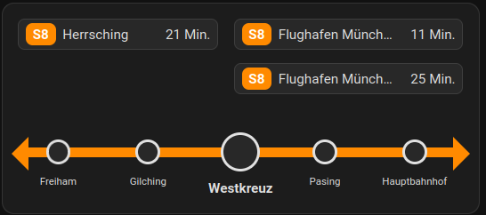

# homeassistant-card-mvg-departures

A Home-Assistant card to show departures for MVG:



# Example

```yaml

lovelace:
  mode: yaml
  resources:
    - url: /local/mvg-departures-card.js
      type: module
  dashboards:
    mvg-dashboard:
      mode: yaml
      title: MVG
      show_in_sidebar: true
      filename: mvg-dashboard.yaml
  
sensor:
  - platform: mvg
    nextdeparture:
     - station: Westkreuz
       name: Westkreuz S8
       lines: ["S8"]
       products: ["S-Bahn"]
       timeoffset: 10
```

```yaml
# file: mvg-dashboard.yaml
views:
  - name: MVG
    cards:
      - type: "custom:mvg-departures-card"
        entity: sensor.westkreuz_s8
        name: Westkreuz # <- Define the station name that will be displayed at the center of the arrow
        line_color: '#FF8A00' # <- Configure the color for all colored elements
        directions:
          left:
            destinations: ["Herrsching"] # <- Used to match the departures to the left arrow
            highlights: ["Freiham", "Gilching"] # <- Display small stations on the arrow
          right:
            destinations: ["Flughafen München","Ostbahnhof", "Pasing", "München Hbf"]
            highlights: ["Pasing", "Hauptbahnhof"]

```
